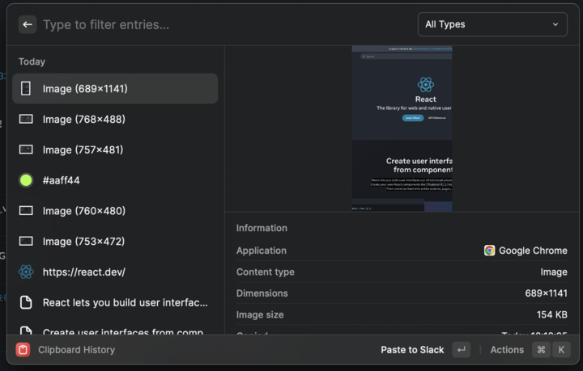
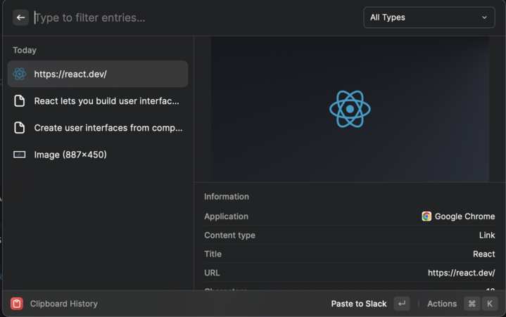
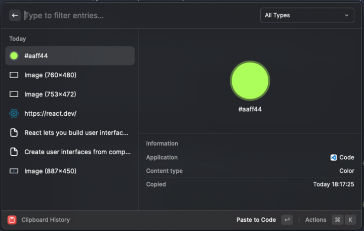
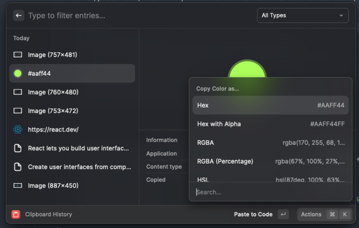
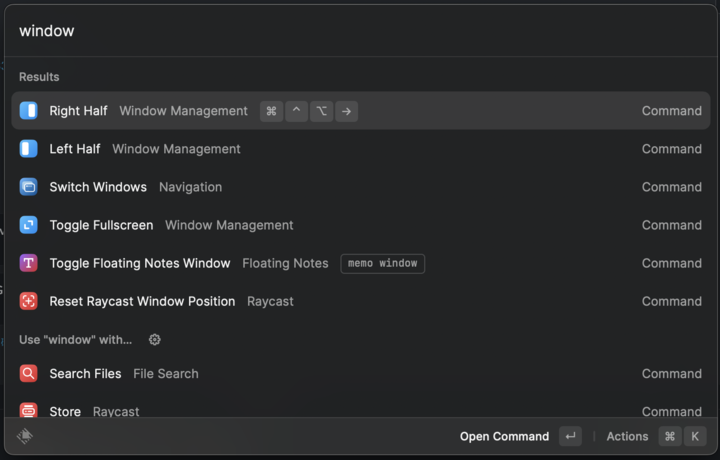
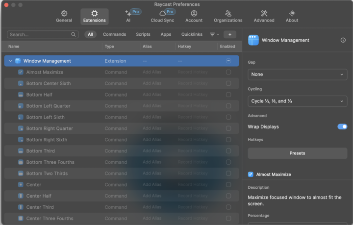

- [Introduction](#introduction)
- [第一印象](#第一印象)
- [クリップボード履歴](#クリップボード履歴)
- [ウィンドウ配置の機能](#ウィンドウ配置の機能)
- [Translateをブラウザを開かずに起動できる](#translateをブラウザを開かずに起動できる)

## Introduction

発端

> Alfredでrebootやshutdownかけたとき、起動時に強制的に前回開いていたウィンドウを再度開かれてムム……となったので、なんとなくraycastに乗り換えてみる
> 

## 第一印象

Alfreadでできていたことは大概出来るイメージ

というか僕自身がAlfreadの使う機能として

- 計算
- ファイルへのアクセス
- アプリの起動
- ブラウザのブックマークへの遷移

しかやってなかったので、まぁできるよな……といった感じ

ただ、Alfreadにはない標準で機能のあれこれがついているのがすごく嬉しいので、書き綴る

## クリップボード履歴

便利ツールではClipyを入れることを推奨していたが、Clipyいらずになる

テキストのコピーはもちろん、画像のコピーもプレビュー付きで確認できる、カラーコードはプレビューと各形式に変換可能、URLはタイトルとOGP画像を表示してくれるなど非常に便利

極めつけは検索もできるのでもうClipyを使う必要がなくなってしまった

## ウィンドウ配置の機能

僕はフルスクリーンで表示する派だけど、右と左にウィンドウ半分で表示したいときが多々あるので、ShititというアプリでそれをしていたがなんとRaycast標準の機能でそれが存在してしまった

`Control + Option + Command + left / right` のショートカットキーを割り当てれば瞬時にウィンドウの配置・大きさを変更できて便利

左にブラウザを置きながら右にメモみたいな使い方をする人はとくに便利かも。

## Translateをブラウザを開かずに起動できる

Raycast上ですべてが完結してしまう

また、選択した文字をraycast上で翻訳できるようになるので、他のアプリを使用せずともすべて完結するようになる。まじで。

翻訳した文章はEnterでクリップボードに保存されるのでどこにでもコピペが可能。
