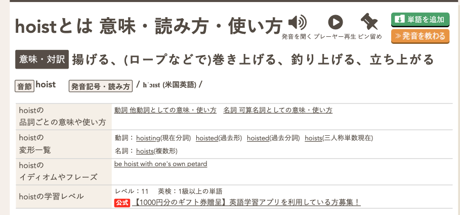

- [日本語超まとめ](#日本語超まとめ)
- [Introduction](#introduction)
- [What is hoisting?](#what-is-hoisting)
- [What is hoisting on Typescript?](#what-is-hoisting-on-typescript)
- [Which is suitable to use function or arrow function?](#which-is-suitable-to-use-function-or-arrow-function)
- [What is the closure on Javasciprt?](#what-is-the-closure-on-javasciprt)

## 日本語超まとめ

関数の巻き上げという仕様があり、constの変数にarrow関数を格納するのとfunctionで関数定義するのでは仕様が異なり、nullableな変数の扱いが異なるので気をつけようねの会

と思ったけど、どうやら関数の入れ子の場合はクロージャという概念がある様子。クロージャとはなにか？

基本的にクロージャは避けたほうが良いという個人的主観。クラス的な使用方法になってしまうし関数がスコープ外の変数を使用すると可読性が下がるので避けようね♡

## Introduction

I wrote it.

```tsx
const Foo = () => {
  const parentElement =
    document.querySelector<HTMLDivElement>(".parentElement");

  if (!parentElement) return;

  const childElement = parentElement.querySelector(
    ".parentElement__childElement"
  );

  if (!childElement) return;

  function Bar() {
    const grandChildElement = parentElement.querySelector(
      "parentElement__grandChildElement"
    );
  }

  Bar();
};
```

Then, TS said parentElement is possibly ‘null’.

I wonder if I changes the function to arrow function.

```tsx
  const Bar = () => {
    const grandChildElement = parentElement.querySelector(
      "parentElement__grandChildElement"
    );
  }
```

TS was silent. 

🤔 WHY????

## What is hoisting?

What is hoisting?




🤔

Hoist means

> raise (something) by means of ropes and pulleys.
> 

OK, next.

## What is hoisting on Typescript?

[関数宣言と巻き上げ (hoisting) | TypeScript入門『サバイバルTypeScript』](https://typescriptbook.jp/reference/functions/function-declaration-and-hoisting)

const variable is not hoisted.

> アロー関数は、constやlet、varで作る必要があるため、関数の巻き上げが起こりません。そのため、上のサンプルコードのように先に処理の概要を示すようなパターンはそのまま書くことができません。
> 

[従来の関数とアロー関数の違い | TypeScript入門『サバイバルTypeScript』](https://typescriptbook.jp/reference/functions/function-expression-vs-arrow-functions#巻き上げと関数定義と呼び出しの順序:~:text=アロー関数は、constやlet、varで作る必要があるため、関数の巻き上げが起こりません。そのため、上のサンプルコードのように先に処理の概要を示すようなパターンはそのまま書くことができません。)

The arrow function is not hoisted because it uses const, let, and var. In fact, the arrow function is not the function. That is a variable.

The function is hoisted. So my codes are finally …

```tsx
const Foo = () => {
  function Bar() {
    const grandChildElement = parentElement.querySelector(
      "o-parentElement__grandChildElement"
    );
  }

  const parentElement =
    document.querySelector<HTMLDivElement>(".o-parentElement");

  if (!parentElement) return;

  const childElement = parentElement.querySelector(
    ".o-parentElement__childElement"
  );

  if (!childElement) return;

  Bar();
};
```

The Bar function moves at top, so the parentElement is possibly “null”.

Be careful for Typescript hoisting!

## Which is suitable to use function or arrow function?

My friend said “function reflects to global, so you should be careful to use function instead of arrow function.” So which is suitable to use function or arrow function?

~~Basically, we should use arrow function to prevent reflecting to global.~~ 

I think many developer said “you should use arrow function” when I heard it. When we use to function? What does function have strong point?

[Functions - JavaScript | MDN](https://developer.mozilla.org/en-US/docs/Web/JavaScript/Guide/Functions#nested_functions_and_closures)

Then, MDN said “closure” 

## What is the closure on Javasciprt?

At first, I need to know about closure.

[クロージャってなんだ？ JavaScript（TypeScript）以外で使ったことないけど。](https://tadtadya.com/what-is-closure/)