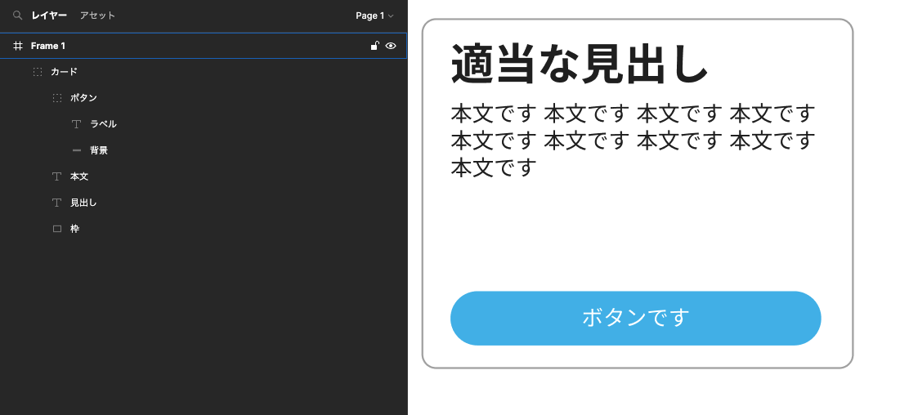

## Introduction

デザインのテキストを、見ながら手入力するとミスが怖い。

なので、デザインファイルからテキストをコピーして持ってくるのが安全。

Figmaではそのあたりがかなり便利に作られていそう。

## Heading

デザインファイルあるあるだが、表現の方法によってテキストが別れていることがしばしば。

XDでは各テキストをちまちまコピーしていたが、Figmaではそれが必要ない様子。



サンプルで作った

「適当な見出し」「本文です 〜」「ボタンです」のそれぞれを個別でコピーする必要はなく……

ここでいうと「カード」のグループをコピーするだけで

```jsx
適当な見出し
本文です 本文です 本文です 本文です 本文です 本文です 本文です 本文です 本文です 
ボタンです
```

がクリップボードに入る。便利〜〜〜
