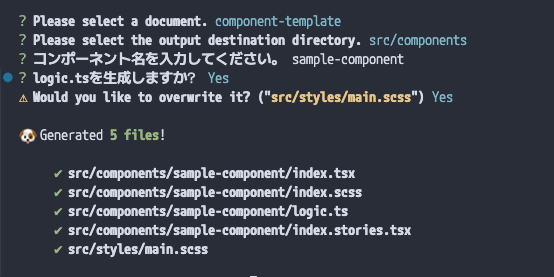

- [Introduction](#introduction)
- [Install](#install)
- [設定ファイル](#設定ファイル)

この際新しくhygenの代わりに入れてみようと思ったパッケージ。

ファイル生成の雛形ファイルをMarkdown形式で記述できる、いわばhygenの代用となるpackage。（アイコンがかわいい）

[scaffdog - Markdown driven scaffolding tool.](https://scaff.dog/)

これも別段やっていることはhygenと変わらない。興味本位で導入したがmarkdownで記述できるのが良い感じ。（僕はejsの記法全然わからないので……）今回はコンポーネントの雛形としてtsx、scss、stories.tsx等を作成してくれるものを記述してみた。

`.scaffdog/commit-template.md` という名称で作成。本当はこれに続いてごちゃごちゃあるのだが長いので省略。

```markdown
---
name: 'component-template'
root: '.'
output: 'src/components'
ignore: []
questions:
  componentName: 'コンポーネント名を入力してください。'
  includeLogic:
    confirm: 'logic.tsを生成しますか？'
    initial: true
---

# `{{ inputs.componentName | kebab }}/index.tsx`

```typescript
import React from 'react';

interface {{ inputs.componentName | pascal }}Props {
  // Propsの型定義をここに追加
}

const {{ inputs.componentName | pascal }}: React.FC<{{ inputs.componentName | pascal }}Props> = ({
  // Propsを追記
}:{{ inputs.componentName | pascal }}Props) => {
  const baseClassName = "{{ inputs.componentName | kebab }}"
  return (
    <div className={baseClassName}>
      {{ inputs.componentName | pascal }}
    </div>
  );
};

export default {{ inputs.componentName | pascal }};

```


実際に走らせてみると以下の感じになる。



markdownで設定が記述できるのが良いし、アイコンが可愛いのが良いところ。

ちなみになんでこういうpackageってワンちゃんの名前なんでしょうか。hygenしかりscaffdogしかり。
