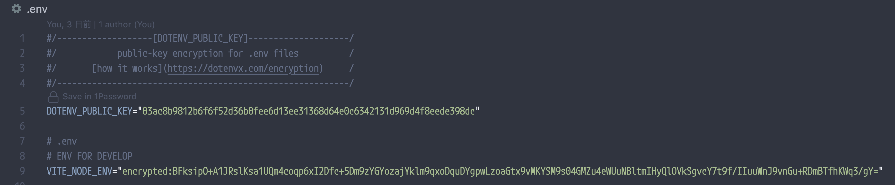
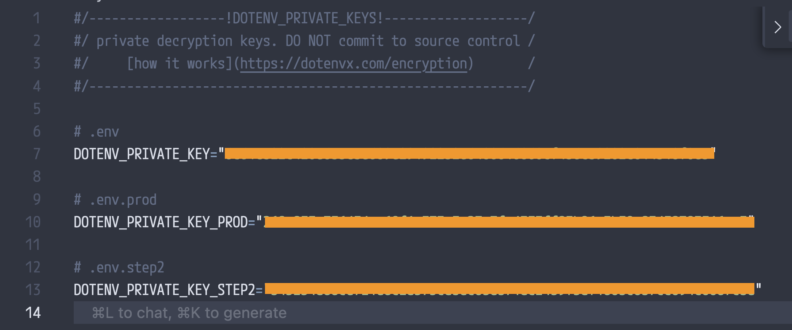
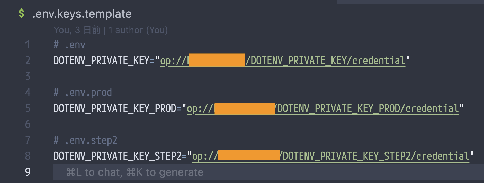

# Introduction

`.env`ファイルはgitの追跡化に置きたくない

とはいえSlackのDMで人から継ぎ足し継ぎ足しするのはしたくない

1passを利用することでそれらの問題を解決できるようにはなってはいるが、今回新たに[dotenvx](https://dotenvx.com/)を利用した管理方法を提案したい

[1passwordの保管庫に登録した秘匿情報から``.env.local``ファイルの生成](/2024-01-11)

# 1. [dotenvx](https://dotenvx.com/)は`.env`ファイルを暗号化できる

```yaml
dotenvx encrypt -f .env
```

上記コマンドを実行することで、`.env`ファイルが暗号化された`.env`ファイルと、複合に使用する`.env.keys`が生成される。



暗号化された.envファイル（gitの追跡化に置くことができる）



暗号化の複合に利用する.env.keysファイル（gitの追跡化においてはいけない）

これにより`.env`をgitの追跡化に置くことができる

複数環境を暗号化した際も、復号化キーは`.env.keys`に集約されるため.env.keysファイルさえあればどの環境変数も利用できる。

ただ、`.env`を追跡下に置く代わりに`.env.keys`を手元で管理するので実質前までと変わらない。

# 2. 1passwordを利用して`.env.keys`を管理する

前回の記事でも記述した通り、1passwordの秘密参照を記述しておくテンプレートファイルを利用してenvファイルを生成することができる。

ただ、テンプレートファイル1ファイルにつき1envファイルの生成しか行えないため、複数環境分コマンドを実行するか、すべてのテンプレートファイルを実行するようなshellないしコマンドを作成する必要がある

そのため、dotenvxで生成した複合キー`.env.keys`を1passの秘密参照に置き換えることで、1passwordのテンプレートファイルひとつですべての環境変数の複合キーを生成することができる。



1passに保存した.env.keysの情報をもつ、.env.keys.templateファイル

```bash
op inject --in-file .env.keys.template --out-file .env.keys
```

<aside>
🚧

**1passwordの保管庫にアクセスできる人間であることが前提なため、外部と連携するときは`.env.keys`をDMで共有しないといけないという、結局……な感じになってしまう**

</aside>
