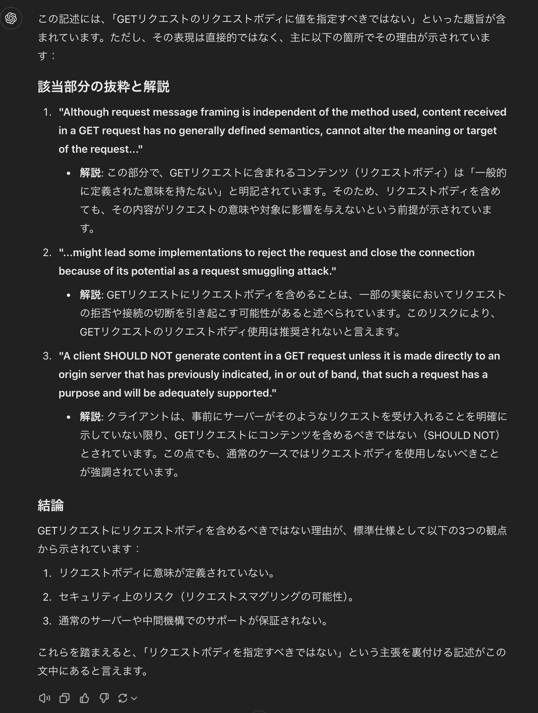

- [Introduction](#introduction)
- [ググる](#ググる)
- [一次情報としてRFC1100を見に行く](#一次情報としてrfc1100を見に行く)
- [MDNのGETメソッドを見る](#mdnのgetメソッドを見る)

# Introduction

search系のAPIがPOSTで実装されている場面に遭遇。

情報の取得ってGETじゃないの？と思ってめちゃくちゃに違和感があったので、なんでPOSTなのか調べてみた

# ググる

以下の記事によると、GETにリクエストボディはRFCに違反しているわけではないが拒否される可能性もあるとの話

[HTTP検索条件、GETにするか？POSTにするか？ | フューチャー技術ブログ](https://future-architect.github.io/articles/20210518a/)

> まずは概念的なあるべき論。
> 
> - 検索（参照）の処理なのにPOSTメソッドを利用するのは分かりにくいのではないか？
> - 例えば、ElasticsearchはGETメソッドにリクエストボディを指定している（POSTにフォールバックもしています）
>     - Issueの[ここ](https://github.com/elastic/elasticsearch/issues/16024)でそれってどうなの？ っていう議論がある
>     - GETにリクエストボディを置くこと自体は、実プロダクトでも事例がある
> - GETにリクエストボディって、RFCに違反していない？
>     - [RFC7231 Hypertext Transfer Protocol (HTTP/1.1): Semantics and Content](https://tools.ietf.org/html/rfc7231)だと、明示的に違反とは書かれていなさそう。GET（とDELETE）でリクエストボディを含めると、実装によってはリクエストが拒否されるかもよという記述
>     - 微妙な記述だが、GETにリクエストボディを指定することを禁じているというわけではなさそう

> 続いて実務的な話へ議論が進むことが多いです。
> 
> - OpenAPIで指定できるの？
>     - OpenAPI Specification v2（Swagger）だと指定可能
>         - 少なくてもgo-swaggerのコード生成は対応していそう
>     - OpenAPI Specification v3だと仕様的に **不可**
>         - `GET, DELETE and HEAD are no longer allowed to have request body because it does not have defined semantics as per RFC 7231.` と書かれている
>         - https://swagger.io/docs/specification/describing-request-body/
> - ライブラリ対応しているのか？
>     - AxiosだとGETでBodyを送ってくれないようだ。[Issue](https://github.com/axios/axios/issues/787)にその話がある
>         - フロントエンドがAxiosに依存していると厳しい..

# MDNのGETメソッドを見る

[GET - HTTP | MDN](https://developer.mozilla.org/ja/docs/Web/HTTP/Methods/GET)

> **メモ:** `GET` リクエストで本文（ペイロード）を送信すると、実装によってはリクエストを拒否することがあります。これは仕様書では禁止されていませんが、その意味は未定義です。 `GET` リクエストでは本文を送るのを避けた方がいいでしょう。
> 

# 一次情報としてRFC1100を見に行く

[RFC9110](https://httpwg.org/specs/rfc9110.html#GET)

> A client *SHOULD NOT* generate content in a GET request unless it is made directly to an origin server that has previously indicated, in or out of band, that such a request has a purpose and will be adequately supported.
> 

