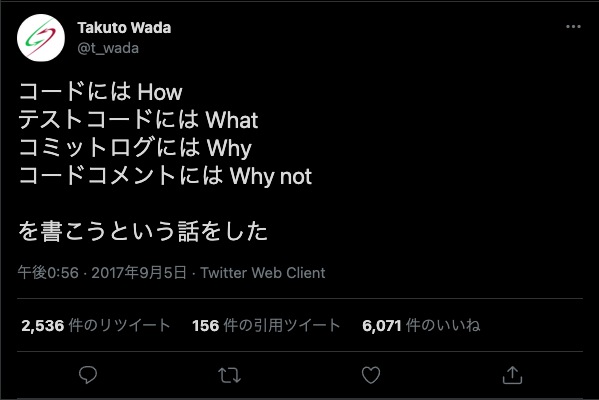
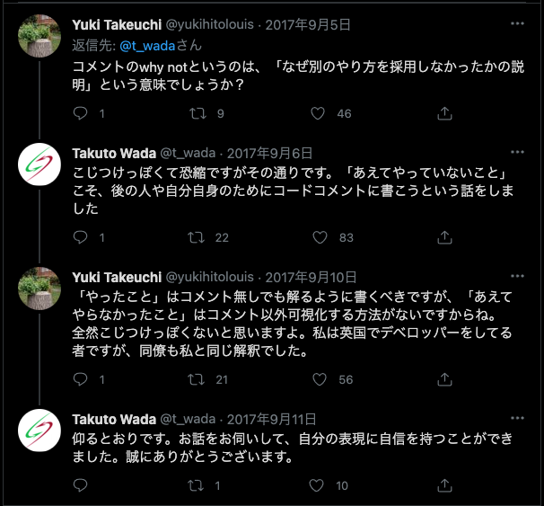
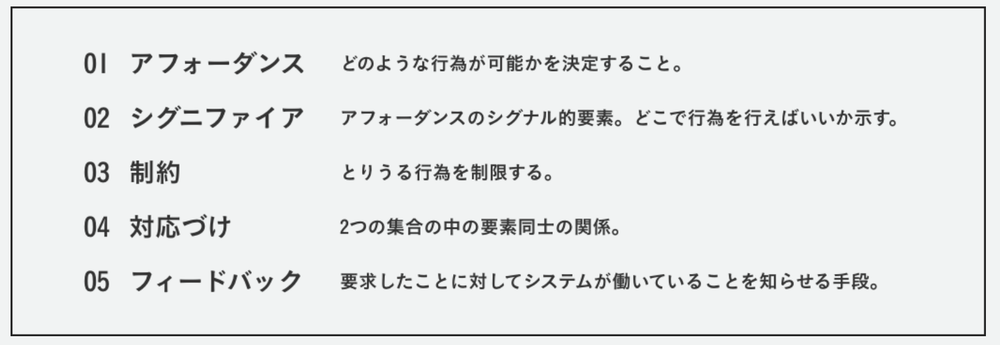

- [(From last week)Comments should be "Why" not "What of How"](#from-last-weekcomments-should-be-why-not-what-of-how)
  - [What I should write comment to some case](#what-i-should-write-comment-to-some-case)
  - [Summary, and in my opnion](#summary-and-in-my-opnion)
- [\<pre\>tag](#pretag)
- [Is oh-my-zsh slow and outdated?](#is-oh-my-zsh-slow-and-outdated)
- [Should I create VScode snippets for button or link CSS styles？](#should-i-create-vscode-snippets-for-button-or-link-css-styles)
- [What is Truthy, Falsy?](#what-is-truthy-falsy)
- [Atomic css](#atomic-css)
- [Connecting issue and pull requests](#connecting-issue-and-pull-requests)
- [シグニファイアと対応付けと蛇口問題](#シグニファイアと対応付けと蛇口問題)
  - [ドナルド・ノーマンのアレ](#ドナルドノーマンのアレ)
- [Gulp](#gulp)
- [FLOCSS](#flocss)
- [Words](#words)
  - [YAGNI](#yagni)
  - [TL;DR](#tldr)
  - [TicTacToe](#tictactoe)
  - [Bow:bow:](#bowbow)
  - [Sob:sob:](#sobsob)
- [Reference](#reference)

## (From last week)Comments should be "Why" not "What of How"

###  What I should write comment to some case



> コードには How
>
> テストコードには What
>
> コミットログには Why
>
> コードコメントには Why not

なるほどね

フロントにおいてはあんまり込み入ったテストコードを書くことは少ないと思うから…

というか今思ったがコメントにおいても**最初に規約として何を書くか定めておいたほうがぶれない**のではないか！？



### Summary, and in my opnion

これも結局の所宗教戦争みたいなもので、どういったことをコメントに記述するかは人によって異なるのかもしれない。なので「自分はこう書くよ！」っていうスタンスを自分なりにもって説明できればいいんじゃないかなとは思ってきた。

Whyを書く、というよりはWhy notを書くは車輪の再開発を防げるけど記述量が増えそうなので、書き方に注意が必要かなとなんとなく思っている

What・Howを書きがちなのでWhy・もしくはWhy notを記述するように心がけたい。そのため原則

- コードは見てわかるような簡潔な記述を心がける
- ロジック・関数名を見直して適切かどうか判断する
- その上でなぜこの実装になったのか理由を記述する・または既に行った方法等を書き残す

とかかなぁ。後日また見返してどうか考えてみてください未来の自分。

## <pre\>tag

整形済みのテキストをそのまま出力してくれるタグ

pythonの\'''code\'''と似てる

## Is oh-my-zsh slow and outdated?

なにやらoh-my-zshのプラグインが数年更新がないという**6年前の記事**を発見してしまった

「とりあえず」という理由で使い続けるのはエンジニア的にまずい気もしているので、本当にoh-my-zshは古いのだろうか、そんでどんなメリット・デメリットが有るのかはっきりさせた上で代替案やoh-my-zshを使う選択肢を取りたい所存

## Should I create VScode snippets for button or link CSS styles？

よく使うようなスタイルはもはやスニペットに入れてしまってもよいのでは？

- linkのホバーアニメーション→アンダーライン左から右、中央から広がる
- buttonのホバーアニメーション→色の反転とか数パターン用意してもよさそう

なんとなくこのへんは結構頻発して使うイメージがあるので登録しておいても良さそう。他のスタイルについては考えるべし

## What is Truthy, Falsy?

> 'truty', 'falsy' のそもそもの意味は、 Boolean の 'true', 'false' ではないんだけど、評価すると 'true', 'false' と振る舞うものです。(つまり 'false' も含みます)
> 論理演算等で暗黙的に変換されたときの値ですね。そこから 'true values', 'false values' とも呼ばれるようです。
> [JavaScript](http://d.hatena.ne.jp/keyword/JavaScript) であれば、 'falsy' な値として以下のものがあります。
>
> - false
> - undefined
> - null
> - 0
> - NaN
> - ''
>
> ```javascript
> > false ? 'truty' : 'falsy'
> 'falsy'
> > undefined ? 'truty' : 'falsy'
> 'falsy'
> > null ? 'truty' : 'falsy'
> 'falsy'
> > 0 ? 'truty' : 'falsy'
> 'falsy'
> > NaN ? 'truty' : 'falsy'
> 'falsy'
> > '' ? 'truty' : 'falsy'
> 'falsy'
> ```
>
> 'truthy' はこれ以外ということになります。

純粋になんで単純なT/Fじゃないんだろうな？という疑問ありけるもの

## Atomic css

やっべぇCssの記述方法を見つけてしまった。バンドルサイズが従来に比べてすっごい小さくなる代わりに激キモな記述をしなければならないという恐ろしい代物。

```html : example.html
<div>
   <div class="Bgc(#0280ae.5) H(90px) IbBox W(50%) foo_W(100%)"></div><!--
--><div class="Bgc(#0280ae) H(90px) IbBox W(50%) foo_W(100%)"></div>
</div>
<hr>
<div class="foo">
   <div class="Bgc(#0280ae.5) H(90px) IbBox W(50%) foo_W(100%)"></div><!--
--><div class="Bgc(#0280ae) H(90px) IbBox W(50%) foo_W(100%)"></div>
</div>
```


お前は一体何を言っているんだ

いくつか疑問があるのはclassのところに指定しているマジックナンバー的なものを変数化して持っておきたいから、そのあたりがどうなるのか

> We just finished porting a decent size app to our new system and guess what, our CSS reduced from `90 KB` to just `8 KB`! 😱

10分の1以下になるとはいえ…というか某記事でも結構疑問に思ってたんだけどバンドルサイズがそれほどパフォーマンスに影響するのか？という点が疑問に思う。考えられないくらいでっかいサービスだったらバンドルサイズまで気を使って小さくまとめたほうが良いのではないかとは思うんだけど、現状僕の関わっている案件ではまだそんなに気にしなくても良い気がしている。

## Connecting issue and pull requests

コミットメッセージ、プルリクのdescription等に`close #number`や`fix #number`等でissueと結び付けられるっぽい。初めて知った……今度からコミットメッセージの方で結びつけようかな

## シグニファイアと対応付けと蛇口問題

ある日我が社の2Fの男子トイレの蛇口が工事されて、今までと違う挙動をし始めた。

うちの会社のトイレの水道は、水とお湯のレバーがそれぞれ3時と9時の方向を向いていて手前に90度回転させ6時の方向にすれば水やお湯が出る仕組みになっている。


従来であれば水の蛇口は3時の方向から6時の方向に90度回転させれば水が開くようになっていたが、工事された結果**レバーが既に6時の方向を向いていて、3時の方向に90度回転させることで水が開くようになっていた**。人と話しながらいつもどおり水を出したんだけど、水を出して3時の方向になっていることでヤバい違和感に気づいた。

ただこれ、**ひねるタイプの水道**と考えると6時から9時の方向に回転させる(反時計回り)ことで開くのは正しく感じる。

？

ネジも反時計回りで緩むし、ペットボトルのキャップだって反時計回りで開くよな？なんで今までは時計回りで水道が出ることに何の違和感もなく使ってたんだ？

混乱してきて時計回りが正しいのか反時計回りが正しいのかわからなくなり、思わず自販機で水を買ってきてキャップをを開け締めしながら先輩に話してみた

「レバータイプの水道だから、ひねって開けるというイメージより**ガスの元栓**の動きのように水平だと閉じる、垂直だと開くみたいな感じじゃない？」

うわ、納得した。

レバーの見た目のくせに蛇口の挙動をしているからすっごい混乱するんだな。

### ドナルド・ノーマンのアレ



これでいうとアフォーダンス自体はレバーなのに実際の挙動は蛇口なので脳がバグるのである

## Gulp

来週まとめます

## FLOCSS

来週まとめます

## Words

### YAGNI

**You ain't gonna need it.**

> "**You ain't gonna need it**"[[1\]](https://ja.wikipedia.org/wiki/YAGNI#cite_note-1)、縮めて **YAGNI** とは、機能は実際に必要となるまでは追加しないのがよいとする、[エクストリーム・プログラミング](https://ja.wikipedia.org/wiki/エクストリーム・プログラミング)における原則である。

### TL;DR

Too long, didn't read

> too long; didn’t readで「長すぎて読まなかった」という意味です。
> ソーシャルメディアやインターネット上で使われるスラングで、必要以上に長い文章の投稿記事につけられる言葉です。
>
> 略語が増えてくる現代ならではの意味のスラングですね。
>
> なお、自身の投稿した記事の概要をさらに短くまとめて「TL;DR」とつけることもあります。
> 「長すぎて読めないよ！という方への要約」というニュアンスが込められています。

### TicTacToe

言うところの三目並べ(マルバツゲーム)らしい\

### Bow:bow:

> to bend your head or body forward, especially as a way of showing someone respect or expressing thanks to people who have watched you perform:

### Sob:sob:

> to cry noisily, taking in deep breaths:

## Reference

[<pre\>: 整形済みテキスト要素 - HTML: HyperText Markup Language | MDN](https://developer.mozilla.org/ja/docs/Web/HTML/Element/pre)

[Triple Quotes in Python - GeeksforGeeks](https://www.geeksforgeeks.org/triple-quotes-in-python/)

[YAGNI - Wikipedia](https://ja.wikipedia.org/wiki/YAGNI)

[TL;DRの意味を勘違いして使っていたら顰蹙を買った ... - Qiitahttps://qiita.com › 英語](https://qiita.com/kei_0121/items/2e2e070702a82a79de8e)

[tl;drって何の略？ - 留学用語集https://ryugaku.kuraveil.jp › 留学用語集 › T](https://ryugaku.kuraveil.jp/dictionaries/520)

[truthy, falsy の訳について考えてみた。 - Block Rockin' Codeshttps://jxck.hatenablog.com › entry](https://jxck.hatenablog.com/entry/20110708/1310080199)

- [Truthy - MDN Web Docs 用語集: ウェブ関連用語の定義https://developer.mozilla.org › docs › Glossary › Truthy](https://developer.mozilla.org/ja/docs/Glossary/Truthy)

- [Falsy (偽値) - MDN Web Docs 用語集: ウェブ関連用語の定義https://developer.mozilla.org › docs › Glossary › Falsy](https://developer.mozilla.org/ja/docs/Glossary/Falsy)

[アトミックCSSへの移行](https://engineering.wingify.com//posts/shift-to-atomic-css/)

[Atomic CSShttps://acss.io](https://acss.io/)

[プルリクエストをIssueにリンクする - GitHub Docshttps://docs.github.com › tracking-your-work-with-issues](https://docs.github.com/ja/issues/tracking-your-work-with-issues/linking-a-pull-request-to-an-issue)

[使いやすいデザインに不可欠なインタラクション原則（前編）](https://ux.daishinsha-cd.jp/blog/使いやすいデザインに不可欠なインタラクション原則前編)

[使いやすいデザインに不可欠なインタラクション原則（後編）](https://ux.daishinsha-cd.jp/blog/使いやすいデザインに不可欠なインタラクション原則後編)

[具体例から考えるアフォーダンスとシグニファイアの違い](https://sevendex.com/post/6841/)

