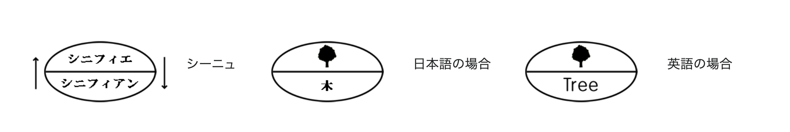

- [Gulp (from last week)](#gulp-from-last-week)
- [FLOCSS](#flocss)
- [ABEMA](#abema)
- [シニフィアンとシニフィエ](#シニフィアンとシニフィエ)
  - [「なにもない」のアフォーダンス](#なにもないのアフォーダンス)
- [Blur and focusOut](#blur-and-focusout)
  - [What's the Bubblinig and Capturing](#whats-the-bubblinig-and-capturing)
- [Refelence](#refelence)

## Gulp (from last week)

まとめます

## FLOCSS

CSSのいい感じのディレクトリ構成らしい

結構大規模なものになってくると恩恵がすごそうだけど、個人レベルで作るものだったらそんなに細分化せずに必要な部分だけとってきて作るほうが良さそうな気がした

## ABEMA

ブラウザ版ABEMAリニューアルの話が興味深かった

特に画像で理想と現状のズレを探る部分がけっこうよさそう

## シニフィアンとシニフィエ

「『ねるねるねるね』の『ねるねる』感すげえよな」っていうのがシニフィアンとシニフィエ？

ねるねるねるねという言葉(**シニフィアン**)に対して、柔らかい・丸い(**シニフィエ**)という言葉からのイメージを持つことを**シーニュ**という？

> - その関係に必然性はない。（記号の恣意性）  
>   - たとえば、「海」そのものを「海」と書き、「う・み」と発音する必然性はどこにもない。もしそうでなければ、あらゆる言語で海は「う・み」と発音されているはずである。
> - 必然性がないにもかかわらず、それが了解される体系のなかでは、必然とされている。
>   - 日本語を解する人が「海」という字を見たり、「う・み」という音を聞いたりするとき、そこでイメージされるものの根底は基本的に同じである。また、「海」はどうして「う・み」というのか、という質問に答えることは非常に難しい。

ふーん、おもしれー言葉。

### 「なにもない」のアフォーダンス

「何もない」のアフォーダンスは常に存在しているけど何かしらの形で人間がシグニファイアで形にしない限り、認知はできるけど存在はできない的な？

## Blur and focusOut

- Blur … フォーカスアウトしたとき(バブリングしない)
- ForcusOut … フォーカスアウトしたとき

### What's the Bubblinig and Capturing

バブリングとは…子要素で特定のイベントが発火したときに、それが親要素にまで伝搬するようなものである

バブリングしないというのは子要素だけでイベントが完結するということ？

キャプチャリングはバブリングで上まで伝搬したものがそのまままた子要素に伝搬していくようなもの？よくわかんねーからまたこれについて調べないといけなさそう

## Refelence

[hiloki/flocss: CSS organization methodology. - GitHubhttps://github.com](https://github.com/hiloki/flocss)

[CSS設計 私のためのFLOCSSまとめ](https://qiita.com/super-mana-chan/items/644c6827be954c8db2c0)

[ABEMA ブラウザ版リニューアルの裏側](https://developers.cyberagent.co.jp/blog/archives/32281/)

[シニフィアンとシニフィエ - Wikipedia](https://ja.wikipedia.org/wiki/%E3%82%B7%E3%83%8B%E3%83%95%E3%82%A3%E3%82%A2%E3%83%B3%E3%81%A8%E3%82%B7%E3%83%8B%E3%83%95%E3%82%A3%E3%82%A8)

[フェルディナン・ド・ソシュール - シーニュ、シニフィアンとシニフィエ - Wikipedia](https://ja.wikipedia.org/wiki/%E3%83%95%E3%82%A7%E3%83%AB%E3%83%87%E3%82%A3%E3%83%8A%E3%83%B3%E3%83%BB%E3%83%89%E3%83%BB%E3%82%BD%E3%82%B7%E3%83%A5%E3%83%BC%E3%83%AB#:~:text=%E3%82%B7%E3%83%BC%E3%83%8B%E3%83%A5%E3%80%81%E3%82%B7%E3%83%8B%E3%83%95%E3%82%A3%E3%82%A2%E3%83%B3%E3%81%A8%E3%82%B7%E3%83%8B%E3%83%95%E3%82%A3%E3%82%A8%5B%E7%B7%A8%E9%9B%86%5D)

[バブリング と キャプチャリング - 現代の JavaScript](https://ja.javascript.info/bubbling-and-capturing)

