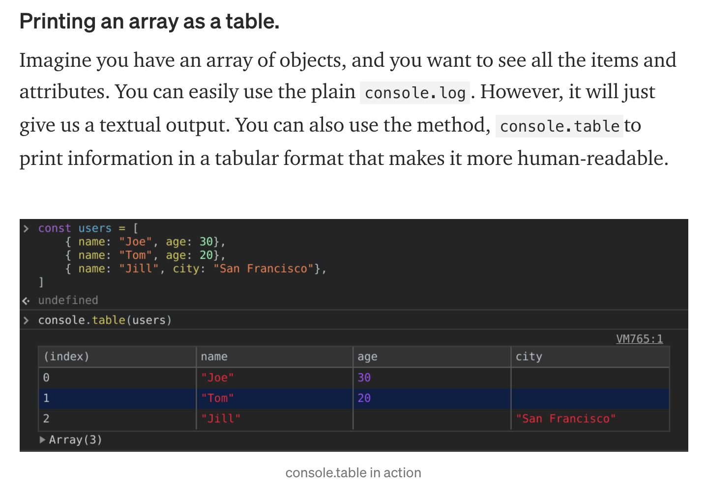
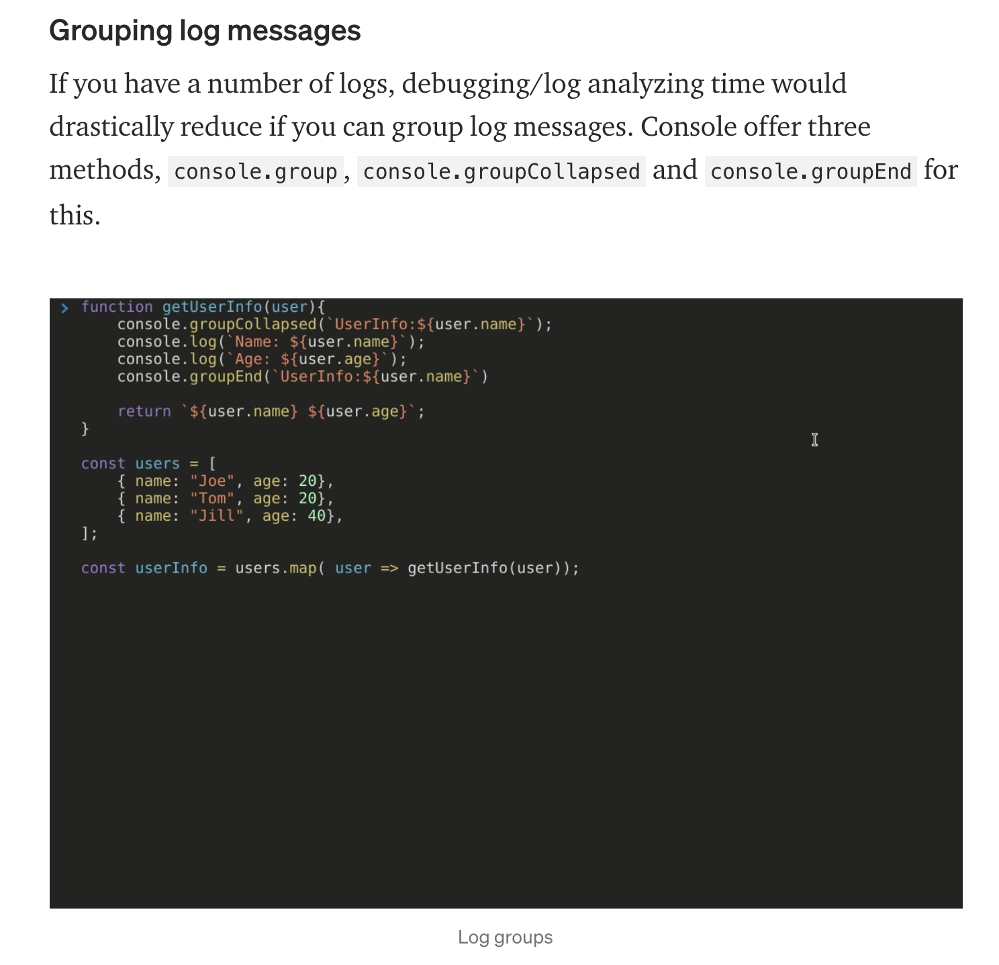
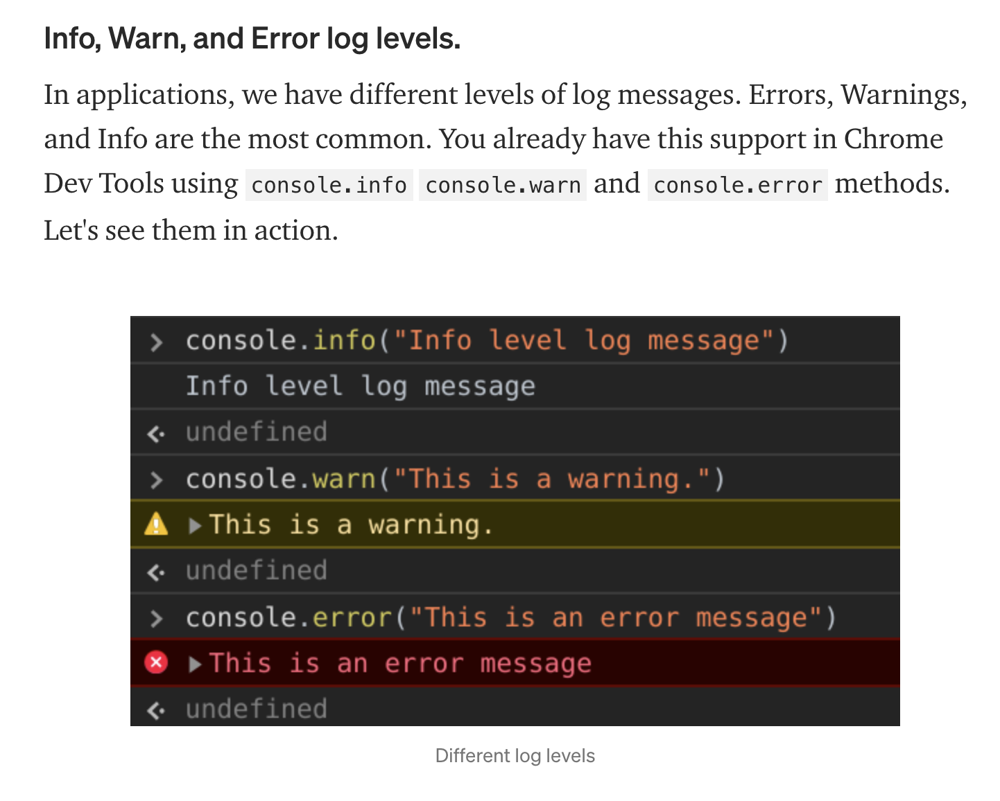
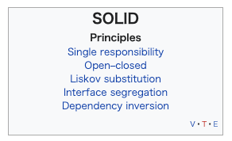

- [Chrome dev tool tips](#chrome-dev-tool-tips)
  - [console.table](#consoletable)
  - [Grounping log messages](#grounping-log-messages)
  - [Info, Warn, and Error log levels](#info-warn-and-error-log-levels)
  - [designMode](#designmode)
- [Remex](#remex)
  - [一体何が嬉しいのか](#一体何が嬉しいのか)
- [What's SOLID](#whats-solid)
- [Tips to be best react developer](#tips-to-be-best-react-developer)
- [@use vs @import in scss](#use-vs-import-in-scss)
- [img tag srcset](#img-tag-srcset)
- [Refference](#refference)

## Chrome dev tool tips

### console.table

APIから返ってきたresponseとか見るのにめっちゃいいじゃん…早めに知りたかった…

…と思ったが、使用感はそんなに良くない…？イマイチ見づらいというか、テーブルが増えてくると画面を広げなければいけない関係上、あまり多くの情報が返ってくるものに対しては向かない気がしてきた。

### Grounping log messages

便利そうではあるんだけど、ここまで書くかな…？といった感じ

これ用のスニペットつくってどかっと入れるようになればよさそうだけど、どうなんだろう…実験的にどこかで使ってみて、使いやすかったらスニペット化がよさそう

### Info, Warn, and Error log levels

これ結構良さそう。APIぶっ叩いて返ってくるときのエラーメッセージとかconsole.errorで表示すれば良さそう。

### designMode

document.designMode='on'

で画面上のテキストを直に触ることができるので、文言修正とかしたいときにぱっと直してパッとスクショ取れるので非常に便利そう。

改行とかバックスペースで容易に画面のレイアウトを崩すことができるので、実質レウアウト破壊爆弾なのかもしれない

## Remex

reactのフレームワークでいい感じのUXを実現してくれそうなあれこれ

よく調べてないけど見た感じサイトがすごい洒落が効いている感じなのはわかった

> Focused on web fundamentals and modern UX, you’re simply going to build better websites]

### 一体何が嬉しいのか

Next.jsでは出来なかったような部分的なレンダリングとかができる？

ヘッダーの検索とかに文字を入力して画面遷移するとNextだと消えていたものがRemixだと再レンダリングされず情報がそのまま保持される的な？

## What's SOLID

is not Metal Gear Solid

## Tips to be best react developer

https://qiita.com/baby-degu/items/0b02b0f7e5d005cd612c

記事を読め

## @use vs @import in scss

どうやら`@import`は非推奨どころか使用できなくなるらしく、`@use`の使用を推奨しているらしい。

## img tag srcset

3年前の記事の割に知らないことが多かった…知見だぁ

今までレスポンシブの画像対応は各案件でやっていた気がするけど、やっぱりパフォーマンスに影響してくるのか…

## Refference

[10 Tips to Improve Productivity using Chrome Dev Tools](https://blog.bitsrc.io/10-tips-to-improve-productivity-using-chrome-dev-tools-7918fc8203f3)

https://remix.run/

[Remix という 考え方](https://zenn.dev/kaa_a_zu/articles/fbd06ca2cc3b86)

[触ってみてわかったNext.jsと比べた時のRemixの特徴](https://zenn.dev/steelydylan/articles/remix-nextjs-comparison)

[開発者が知っておくべきSOLIDの原則 | POSTD](https://postd.cc/solid-principles-every-developer-should-know/)

https://qiita.com/baby-degu/items/0b02b0f7e5d005cd612c

[Sassを@importから@useに置き換えるための手引き](https://kojika17.com/2020/05/next-generation-sass-module-system.html)

[imgのsrcset属性について](https://qiita.com/sigwyg/items/6735828ca97b93b03714)