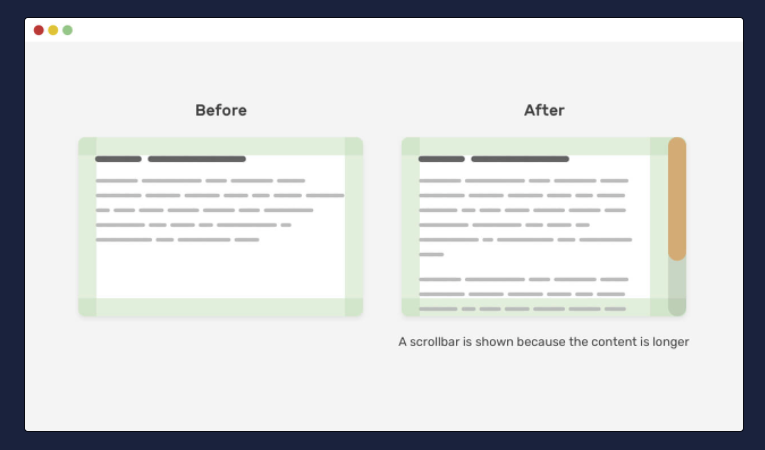

- [What cause my mistakes?](#what-cause-my-mistakes)
- [`scrollbar-gutter: stable`](#scrollbar-gutter-stable)

## What cause my mistakes?

[参考](https://zenn.dev/ikenohi/articles/78964bb348cdfa)

## `scrollbar-gutter: stable`

たしかにこういう状況わりとあるな

[参考](https://ishadeed.com/article/defensive-css/#:~:text=an%20updated%20figure.-,Scrollbar%20Gutter,-Another%20thing%20that)

[scroller-gutter](https://developer.mozilla.org/en-US/docs/Web/CSS/scrollbar-gutter)

> `stable`
>
> When using classic scrollbars, the gutter will be present if `overflow` is `auto`, `scroll`, or `hidden` even if the box is not overflowing. When using overlay scrollbars, the gutter will not be present.