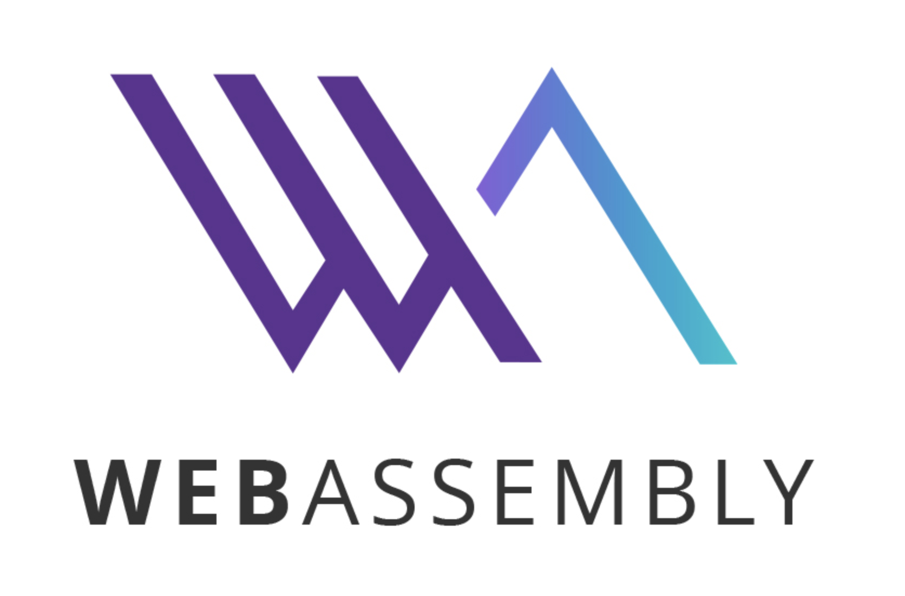

- [Frontend security](#frontend-security)
- [ESbuild](#esbuild)
  - [Overrides](#overrides)
- [Interface vs Type in Typescript](#interface-vs-type-in-typescript)
  - [Interface](#interface)
  - [Type](#type)
  - [Which are suitable?](#which-are-suitable)
- [What's Web Asembly?](#whats-web-asembly)

## Frontend security

- [ ] 結局今週もまとめてないね！！！

## ESbuild

メロスは激怒した。

プロジェクト内のyarn startが二種類あり、esbuildでエラーが起きwebpackでは再現しないところを見るとビルドシステムに立ち返り見直さなければいけない。

必ず、かの荒唐無稽なpackage.jsonを見直さなければならぬと決意した。

メロスにはESbuildがわからぬ。

### Overrides

なんか別のプロジェクトで当てたoverridesのjsが生きてて、なぜかそれが邪魔して今の環境でスタイルが反映されないとかいう死ぬほどアホアホな現象が起きてしまった。

overridesを使うときは使った後すぐ無効化するか、もともと当てる場所を限定しようね！

## Interface vs Type in Typescript

[interfaceとtypeの違い、そして何を使うべきかについて](https://zenn.dev/luvmini511/articles/6c6f69481c2d17)

[TypeScript で type と interface どっち使うのか問題](https://zenn.dev/seya/articles/aa94166c977280)

実際何が違うんって感じでしたけど、言語化する必要があるなと思いました。

- [x] 読め

### Interface

- 同じ名前の型が宣言された場合は自動的にマージされるらしい

- [interfaceのほうが速度的によいこともあるらしい](https://stackoverflow.com/questions/37233735/interfaces-vs-types-in-typescript#:~:text=When%20it%20comes%20to%20compilation%20speed%2C%20composed%20interfaces%20perform%20better%20than%20type%20intersections%3A)

  - > When it comes to compilation speed, composed interfaces perform better than type intersections:

- typeと違って拡張ができる

### Type

- union型やtuple型を作成することができる
- 拡張はできない

### Which are suitable?

まぁ結局宗教戦争のようなものだとは思う

公式ではinterfaceの使用を勧めているみたいだけど、typeを使用すると知らんうちに拡張されていたみたいなことが無いから安心とかいう話もある

## What's Web Asembly?

ロゴがかっこいい、グラデーションを使っているあたりかなりモダンな雰囲気が…。

[web assembly](https://developer.mozilla.org/ja/docs/WebAssembly)

> WebAssembly はモダンなウェブブラウザーで実行できる新しいタイプのコードです。ネイティブに近いパフォーマンスで動作するコンパクトなバイナリー形式の低レベルなアセンブリ風言語です。さらに、 C/C++ や Rust のような言語のコンパイル対象となって、それらの言語をウェブ上で実行することができます。 WebAssembly は JavaScript と並行して動作するように設計されているため、両方を連携させることができます。

[WebAssemblyとJavaScriptの処理速度を比較してみる](https://qiita.com/mink0212/items/c7fc8d1e7c036b706544)

[WASMとRustはVue.js/React.jsを打倒するのか？ - JSへの侵略の歴史](https://zenn.dev/koduki/articles/c07db4179bb7b86086a1)

[Typescriptの次はRustかもしれない](https://zenn.dev/akfm/articles/81713d4c1275ac64a75c)

- JSの実行速度はそんなに早くない
- web上で機械語を実行しようとする試みがある(爆速なので)
- rustとか注目されている

[急な思いつきでrustと戦ってみようと思う](https://github.com/Shigi-p/rust-test)

