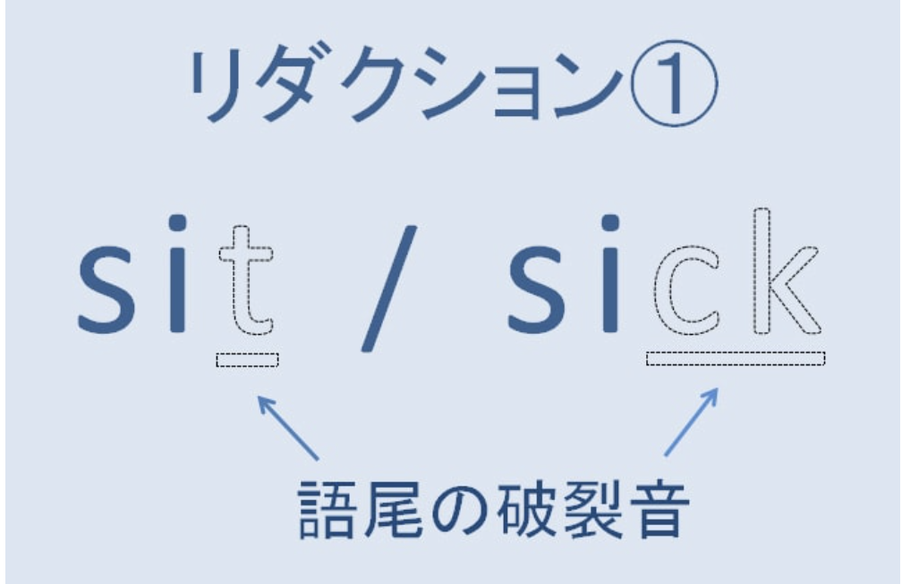
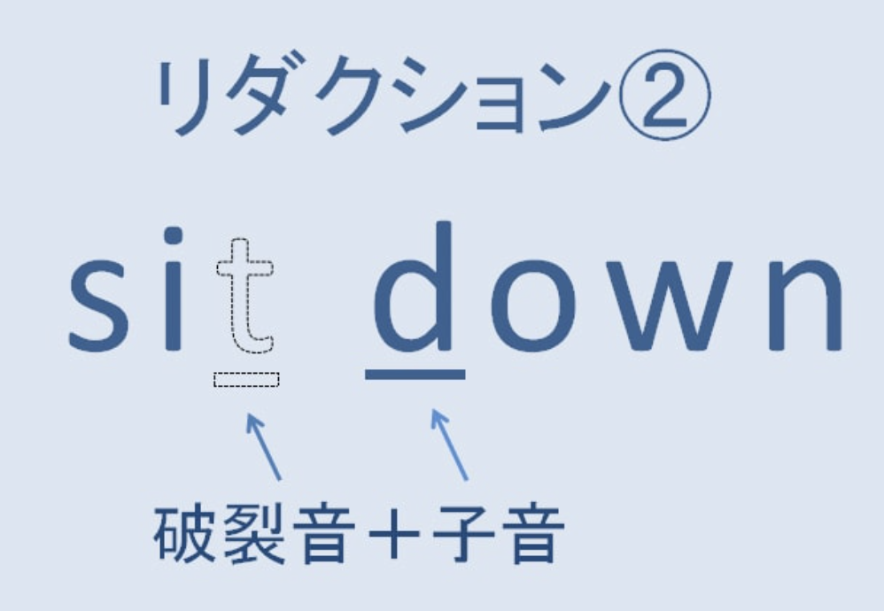
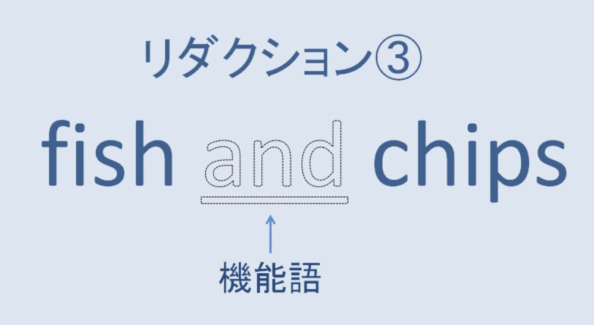

- [Relationship speed and quality](#relationship-speed-and-quality)
- [Rust 1.58](#rust-158)
- [React startTransition](#react-starttransition)
- [React useTransition](#react-usetransition)
- [React suspence](#react-suspence)
- [Single Responsibility Principle :SR P](#single-responsibility-principle-sr-p)
- [How to get thumbnail of youtube movie?](#how-to-get-thumbnail-of-youtube-movie)
- [Reduction (learning for English)](#reduction-learning-for-english)
- [Other](#other)


## Relationship speed and quality

[質とスピード（2020秋100分拡大版） / Quality and Speed 2020 Autumn Edition](https://speakerdeck.com/twada/quality-and-speed-2020-autumn-edition)

[共通の価値観としての「リードタイム」](https://i2key.hateblo.jp/entry/2017/05/15/082655#:~:text=%E3%81%AB%E3%81%AA%E3%82%8A%E3%81%BE%E3%81%99%E3%80%82-,%E5%85%B1%E9%80%9A%E3%81%AE%E4%BE%A1%E5%80%A4%E8%A6%B3%E3%81%A8%E3%81%97%E3%81%A6%E3%81%AE%E3%80%8C%E3%83%AA%E3%83%BC%E3%83%89%E3%82%BF%E3%82%A4%E3%83%A0%E3%80%8D,-SoE%E3%83%A9%E3%82%A4%E3%82%AF)

えげつい耳の痛いお話

> **保守性を犠牲にすればスピードは得られる？**
>
> - 短期的には得られる
> - 1ヶ月後には逆効果になる
>   - 1ヶ月以内であれば、内部品質への投資の受益者は自分たち自身であり、つまり道徳や矜持の話ではなく損得の話である
> - 長期的には致命傷になる

ひえええ

> では、品質と速度についてのトレードオフが意識されるとき、実際には何と何が秤にかけられているのか。
>
> それは各個人ではなくプロダクト全体の品質と速度が秤にかけられているのではないか。言い換えれば、プロダクトの品質を支えるために必要な**メンバーの成長とその成長のために必要なフィードバックや学習の時間**が秤にかけられているのではないかと思う。

ぐああああああ

[Webフロントエンドの開発効率を高く保つための考え方](https://zenn.dev/adwd/articles/e173f75c512e10)

えげつい耳の痛いお話第二弾

> 序盤に出てくる刺さったフレーズを2つ雑に要約してみます。
>
> 1. 汚いコードを書く方がクリーンなコードを書くより常に遅い
>    - スタートアップだから、開発初期だからコードが汚くていいということはない
> 1. ソフトウェアの構造は振る舞いと同等の価値を持つ（構造≒変更が容易であること）
>    - 完璧に動作するけど変更ができないより、バグだらけだけど変更が容易な方が良い

気分悪くなる(最高)

木こりのジレンマというのも最高耳が痛かったし最高だった

## Rust 1.58

[Version 1.58.0 (2022-01-13)](https://github.com/rust-lang/rust/blob/master/RELEASES.md#version-1580-2022-01-13)

[Rust 1.58を早めに深掘り](https://tech-blog.optim.co.jp/entry/2022/01/14/080000)

>  [`format!`](https://doc.rust-lang.org/std/macro.format.html)や[`println!`](https://doc.rust-lang.org/std/macro.println.html)などフォーマット系のマクロで変数を直接参照できるようになりました。 これにより`println!("{}", x)`や`println!("{x}", x = x)`ではなく、`println!("{x}")`と簡単に書くことができます。
>
>  ```rust
>  fn main() {
>  let x = 42;
>  println!("{x}");
>  log::info!("{x}");
>  panic!("{x}"); // 2021エディションが必要
>  }
>  …今ちょうどチュートリアルで「めんどくせ〜」ってなってたところ…
>  ```

ある程度デバッグとかが楽になる気がする。

これが対応したら個人的にjsで使っているislogとかislogOとかのスニペットをrustにブチ混んだら幸せになれそう

## React startTransition

[New feature: startTransition #41](https://github.com/reactwg/react-18/discussions/41)

- [ ] ちょっと後で見てみて欲しい

## React useTransition

ちょっっっっっっっっっっっっっっっっっっっっっっとまて俺の求めていたものはコレではないのか！？(名前的に)

[🎊Reactの2種類の新フック「useTransition」と「useDeferredValue」を最速で理解する（プレビュー版）](https://qiita.com/uhyo/items/6be96c278c71b0ddb39b)

> - Reactがレンダリングを中断したり並行実行できるようになるよ
> - `useTransition`は**今の画面を残しつつ次の画面を裏でレンダリング**したいときに使えるよ
> - `useDeferredValue`は値の遷移を**いい感じに遅延**してほしいときに使えるよ

んむむむ…近そうだ

[トランジション](https://ja.reactjs.org/docs/concurrent-mode-patterns.html#transitions)

- [ ] ちょっと後で見てみて欲しい

## React suspence

調べれば調べるほど知らんこと出てくるなまったく

サスペンスは18.0alphaにからの機能で読み込み時にうまいことレンダーを制御してくれるようなあれこれ

> Facebook では今のところ、本番環境において Relay のサスペンス連携機能のみを利用しています。**今すぐ始めるための実用的なガイドが見たい場合は、[Relay のガイドをご覧ください](https://relay.dev/docs/getting-started/step-by-step-guide/)！** 本番環境で既にうまく動作しているパターンについて述べられています。

> 今 Relay を使っていないのなら、サスペンスをあなたのアプリケーションで使うのは待った方がいいかもしれません。現在のところ、Relay が本番環境でテストされ、我々が自信を持っている唯一の実装です。

な、なるほど？

…？そもそも18.0以降でしか実験的に使えないので意味がないのでは…？ボブは訝しんだ

とりあえず知識として持っておくに越したことはない

> React 16.6 で、コードのロードを「待機」して宣言的にロード中状態（スピナーのようなもの）を指定することができる `<Suspense>` コンポーネントが追加されました。

> データ取得用のサスペンスは、**データも含むその他あらゆるものを宣言的に「待機」**するために `<Suspense>` を使えるようにする新機能です。このページではデータ取得のユースケースに焦点を当てて説明しますが、画像やスクリプト、あるいはその他の非同期的な作業の待機にも使えます。

18.0で実験的に追加されているのはfetch等によるデータの取得などのデータ取得用のsuspenceについて言及しているっぽい

## Single Responsibility Principle :SR P

[単一責任の原則 ( Single Responsibility Principle ) とは](https://www.ogis-ri.co.jp/otc/hiroba/others/OOcolumn/single-responsibility-principle.html#:~:text=%E5%8D%98%E4%B8%80%E8%B2%AC%E4%BB%BB%E3%81%AE%E5%8E%9F%E5%89%87%20(%20Single%20Responsibility%20Principle%20)%20%E3%81%A8%E3%81%AF)

毎度のこと関数やメソッドは一つの機能で完結するようにみたいなことを言われるのがこれかな

[単一責任原則 | プログラマが知るべき97のこと](https://xn--97-273ae6a4irb6e2hsoiozc2g4b8082p.com/%E3%82%A8%E3%83%83%E3%82%BB%E3%82%A4/%E5%8D%98%E4%B8%80%E8%B2%AC%E4%BB%BB%E5%8E%9F%E5%89%87/)

97はちょっと多くない…？

## How to get thumbnail of youtube movie?

[Youtube動画からサムネイル画像を取得する方法](https://www.billionwallet.com/goods/youtube_image.html)

そうそう困らないんだけど、動画のサムネイルの素材が欲しくなったときに非常に助かった

## Reduction (learning for English)

[音が消える！？英語のリダクションについて分かりやすく解説します](https://eigohiroba.jp/t/418)

thatが無茶苦茶消えるのはこいつのせいなのか







## Other

[強いエンジニアになるために英語が必要と聞いたので４ヶ月でTOEICスコア400→900まで上げた話](https://qiita.com/NasuPanda/items/5a92505eab4e9da7f4e9)

すご(他人事)