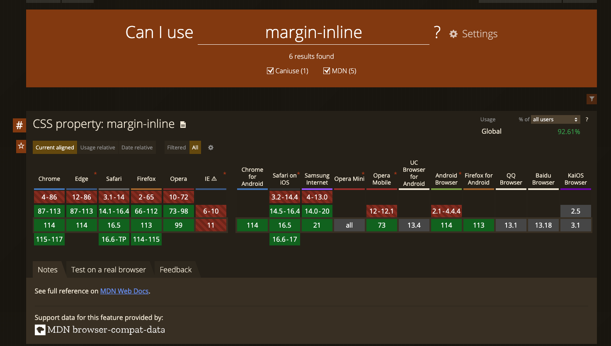
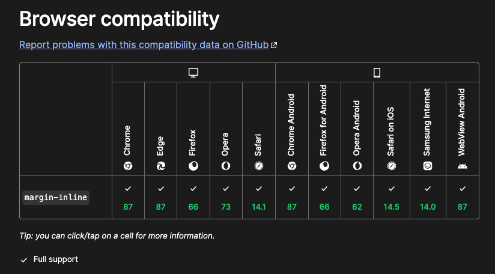
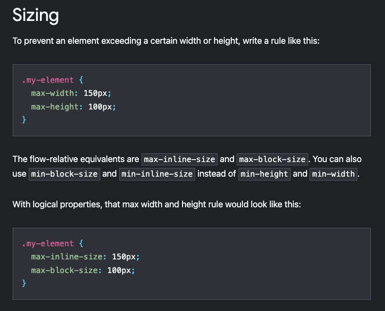
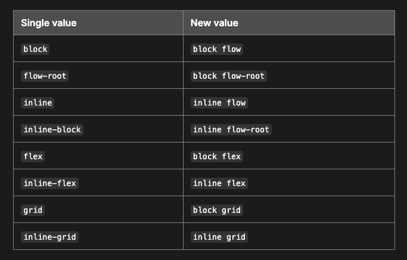

- [超まとめ In Japanese](#超まとめ-in-japanese)
- [Introduction](#introduction)
- [Logical properties](#logical-properties)
  - [Browser support](#browser-support)
  - [Block and Inline](#block-and-inline)
- [Readability](#readability)
- [FYI Multi keyword syntax](#fyi-multi-keyword-syntax)


## 超まとめ In Japanese

blockとinlineという、垂直方向と水平方向を意味する新しいプロパティがあり、marginやpaddingのショートハンドとして`margin-block`や`padding-inline`が使用できる。

個人的意見としてmarginなどのショートハンドとして使用するのはよいが、max-widthなども置き換えられるが可読性が低くなって分かりづらいのでやめたほうがよい。

## Introduction

I saw `margin-block` and `margin-inline` long time ago. These property can set vertical or horizontal values. I wonder the property is used by how many developer and get used to it.

## Logical properties

Have you seen below case to set horizontal margin only?

```jsx
margin: 0 $side-padding;
```

Then we set vertical margin “0”. We set like below to avoid setting vertical margin.

```jsx
margin-right: $side-padding;
margin-left: $side-padding;
```

In this case, we can use **Logical properties**.

[CSS logical properties and values - CSS: Cascading Style Sheets | MDN](https://developer.mozilla.org/en-US/docs/Web/CSS/CSS_logical_properties_and_values)

```jsx
margin-inline: $side-padding;
```

[margin-inline - CSS: Cascading Style Sheets | MDN](https://developer.mozilla.org/en-US/docs/Web/CSS/margin-inline)

> The **`margin-inline`** [CSS](https://developer.mozilla.org/en-US/docs/Web/CSS) [shorthand property](https://developer.mozilla.org/en-US/docs/Web/CSS/Shorthand_properties) is a shorthand property that defines both the logical inline start and end margins of an element, which maps to physical margins depending on the element's writing mode, directionality, and text orientation.
> 

### Browser support

For instance, can I use `margin-inline`?

[CSS property: margin-inline | Can I use... Support tables for HTML5, CSS3, etc](https://caniuse.com/mdn-css_properties_margin-inline)



[margin-inline - CSS: Cascading Style Sheets | MDN](https://developer.mozilla.org/en-US/docs/Web/CSS/margin-inline)



### Block and Inline

Block means vertical order, and Inline means horizontal order.

These value is based on CSS writhing modes (text direction). 

[CSS writing modes - CSS: Cascading Style Sheets | MDN](https://developer.mozilla.org/en-US/docs/Web/CSS/CSS_writing_modes)

## Readability

The logical properties can decrease properties, but decreasing line is one or two. In my opinion, this properties can decrease codes, but readability is bad like below.

[Logical Properties](https://web.dev/learn/css/logical-properties/#sizing)

😡



So if we use logical properties, we need to get used to block and inline means vertical and horizontal first. 

I recommend logical property is uses as vertical and horizontal margin or padding only. Because not used to seeing property like `max-inline-size` is confusing for other developer.

## FYI Multi keyword syntax

[Adapting to the new multi-keyword syntax of display - CSS: Cascading Style Sheets | MDN](https://developer.mozilla.org/en-US/docs/Web/CSS/display/multi-keyword_syntax_of_display#the_multi-keyword_syntax)



We can use display property like inline-flex, inline-block, and grid. Logical property provides our new display property value.