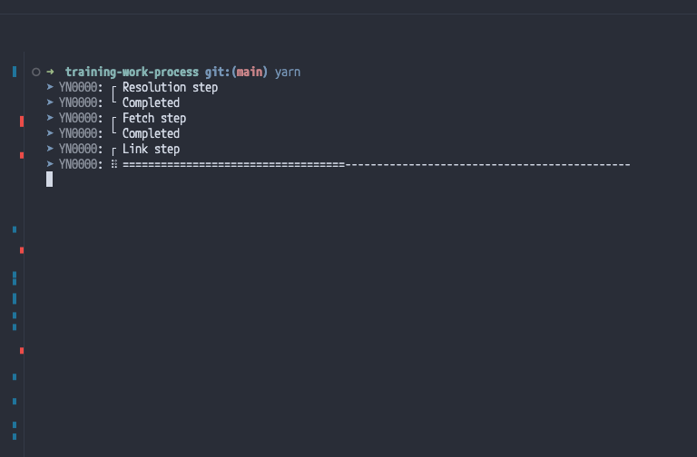

## Introduction

viteでstorybookを使用するとstorybook7系が入るんだけど、なんか起動できなかった

## yarn3系がいいよ

[[Bug]: string-width dependency stops storybook from executing · Issue #22431 · storybookjs/storybook](https://github.com/storybookjs/storybook/issues/22431#issuecomment-1630086092)

issueとして上がっているらしい

せっかくなので、プロジェクトで使用するyarnのバージョンを3に固定したい

[yarn set version | Yarn](https://yarnpkg.com/cli/set/version)

```jsx
yarn set version 3.2.0
```

こうすることで`.yarn/release`ファイルが作成され、バージョン情報のファイルが追加される

yarnを実行すると、node_module的なキャッシュファイルみたいなものが生成されてコミットするときに大変になってしまうのでgitignoreに追記する

```jsx
# yarn
.pnp.*
.yarn/cache
.yarn/install-state.gz
```

こうすることでyarnのバージョンファイルはプロジェクトディレクトリの直下に置きつつ、他の邪魔なファイルを取り除くことに成功

yarnしたときのterminalの表示が楽しげなものになっていたら成功

